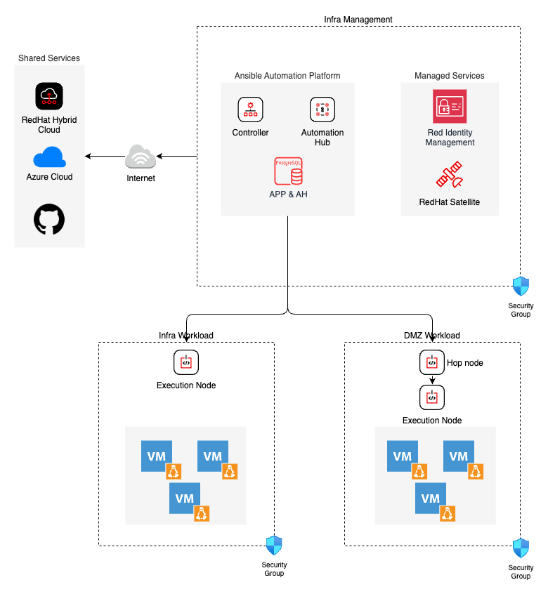
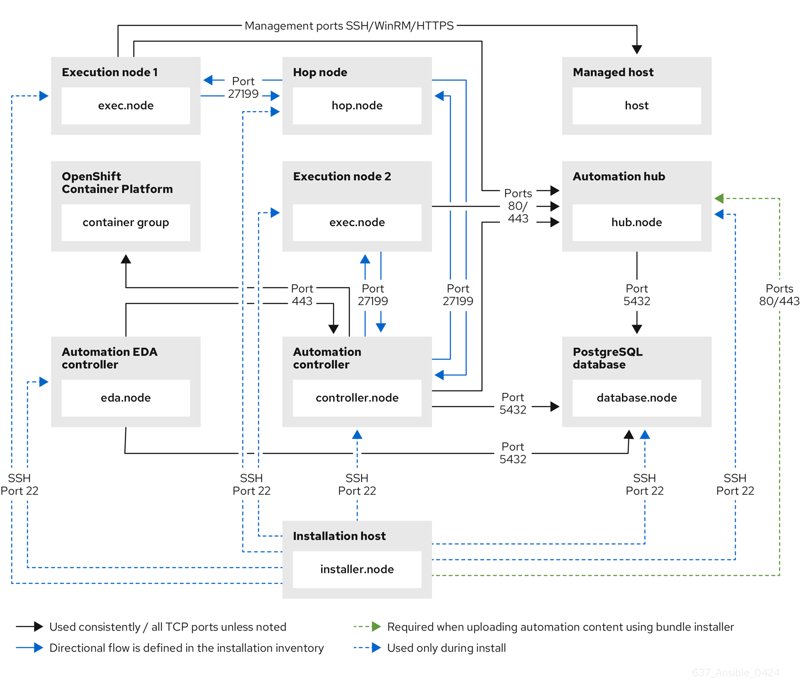

# Ansible Automation Platform Architecture

This document describes the high-level architecture for Ansible
Automation Platform. It will be the cental automation platform for all
components that will be running in cloud provider.

This document provides a comprehensive overview for deploying the Red
Hat Ansible Automation Platform, tailored to the specified requirements.

Even though there are managed Ansible Automation Platform available in
major cloud providers we will aim for a self-managed platform in favour
of flexibility, management, security.

The platform will also connect to upstream for getting Ansible
collection contents from Automation Hub, Ansible Galaxy & RedHat
Certified Ansible collection etc.

# High level design

## Ansible Automation platform components

Components and their specifications in Ansible Automation platform

<table>
<colgroup>
<col style="width: 20%" />
<col style="width: 20%" />
<col style="width: 20%" />
<col style="width: 20%" />
<col style="width: 20%" />
</colgroup>
<thead>
<tr class="header">
<th style="text-align: left;">Name</th>
<th style="text-align: left;">OS</th>
<th style="text-align: left;">CPU’s</th>
<th style="text-align: left;">RAM</th>
<th style="text-align: left;">Storage</th>
</tr>
</thead>
<tbody>
<tr class="odd">
<td style="text-align: left;">
1x Ansible Controller
</td>
<td style="text-align: left;">
RHEL9.x
</td>
<td style="text-align: left;">
2
</td>
<td style="text-align: left;">
16GiB
</td>
<td style="text-align: left;">
32GB default with minimum with at least
20GB available under <code>/var/lib/awx</code> as additional
disk
</td>
</tr>
<tr class="even">
<td style="text-align: left;">
1x Private Automation Hub
</td>
<td style="text-align: left;">
RHEL9.x
</td>
<td style="text-align: left;">
2
</td>
<td style="text-align: left;">
8GiB
</td>
<td style="text-align: left;">
32GB default disk with additional disk
with <code>/var</code> mount
</td>
</tr>
<tr class="odd">
<td style="text-align: left;">
1x PostgresDB (Controller &amp; Hub
DB)
</td>
<td style="text-align: left;">
RHEL9.x Postgres13
</td>
<td style="text-align: left;">
4
</td>
<td style="text-align: left;">
16GiB
</td>
<td style="text-align: left;">
32GB default with additional 100GB disk
with <code>/var/lib/pgsql</code> mount
</td>
</tr>
<tr class="even">
<td style="text-align: left;">
1x Execution Node in Infra
workload
</td>
<td style="text-align: left;">
RHEL9.x
</td>
<td style="text-align: left;">
2
</td>
<td style="text-align: left;">
16 GiB
</td>
<td style="text-align: left;">
32GB
</td>
</tr>
<tr class="odd">
<td style="text-align: left;">
1x Hop node in DMZ Workload
</td>
<td style="text-align: left;">
RHEL9.x
</td>
<td style="text-align: left;">
2
</td>
<td style="text-align: left;">
8GiB
</td>
<td style="text-align: left;">
32GB
</td>
</tr>
<tr class="even">
<td style="text-align: left;">
1x Execution node in DMZ
Workload
</td>
<td style="text-align: left;">
RHEL9.x
</td>
<td style="text-align: left;">
2
</td>
<td style="text-align: left;">
8GiB
</td>
<td style="text-align: left;">
32GB
</td>
</tr>
</tbody>
</table>

Minimum requirements

## Architectural Diagram

{ align=centre }

## Network Requirements

{ align=centre }

## Certificates

Red Hat Ansible Automation Platform components will use an SSL
certificate signed by an external certificate authority (CA) which is
Red Hat Identity Management acting as a subordinate Certificate
Authority. Refer to the certificate requirements from the official
[documentation](https://docs.redhat.com/en/documentation/red_hat_ansible_automation_platform/2.4/html/red_hat_ansible_automation_platform_operations_guide/changing-ssl-certs-keys#changing-ssl-certs-keys).

## Locations

Primarily there are two locations, Intranet and DMZ. We aim to decouple
the execution plane of Ansible Automation Platform in each locations.
Hence the execution of automation is localized in each site.

We will also have a hop node in DMZ to mimic the air-gapped environment
which will connect Ansible Automation Platform Controller with Execution
node.

<table>
<colgroup>
<col style="width: 50%" />
<col style="width: 50%" />
</colgroup>
<thead>
<tr class="header">
<th style="text-align: left;">Name</th>
<th style="text-align: left;">Description</th>
</tr>
</thead>
<tbody>
<tr class="odd">
<td style="text-align: left;">
Intranet
</td>
<td style="text-align: left;">
for internal business workloads and
infrastructure management services
</td>
</tr>
<tr class="even">
<td style="text-align: left;">
DMZ
</td>
<td style="text-align: left;">
for the business workloads which have
public access enabled
</td>
</tr>
</tbody>
</table>

## Organizations

Ansible Automation Controller will have only one organization.

<table>
<colgroup>
<col style="width: 50%" />
<col style="width: 50%" />
</colgroup>
<thead>
<tr class="header">
<th style="text-align: left;">Name</th>
<th style="text-align: left;">Description</th>
</tr>
</thead>
<tbody>
<tr class="odd">
<td style="text-align: left;">
Showroom
</td>
<td style="text-align: left;">
Showroom Organization
</td>
</tr>
</tbody>
</table>

## High Availability

There is no HA built-in for the Controllers and the deployment will use
single Controller making it single point for failure. Even though the
Controller will be in Hybrid (default) mode and it will be able to
launch jobs, we still have the Execution nodes which take the load off
from Controller.

However that is still a SPOF in case the Controller goes down.

## Backup

It is planned to use built-in backup functionality to use in Ansible
Automation Platform to facilitate recovery in the event of disaster.

There should be an Ansible playbook which can restore from backup to
minimize RTO, backups are also taken daily to minimize the RPO.

# Source of truth

Ansible Automation Platform will use scm/git as single source of truth
to manage/maintain managed systems. We plan to use approach similar to
GitOps.

Refer to \#GitOps with Ansible for more details on GitOps

# Inventory

An Inventory is a collection of hosts against which jobs may be
launched. Inventories can be constructed from Cloud Provider, Red Hat
Satellite and / or sourced from a GIT repository.

## Smart Host Filter

Smart Host filter will be used to differentiate different lifecylces for
the hosts like PROD, DEV. QA

# Projects

A Project is a logical collection of Ansible playbooks which is sourced
from the SCM like GitHub. Source Control Type will be `Git` and source
control branch / tag must be set to `devel` pointing to this repository.

For a Continuous Integration (Github Workflow) to spawn a job, it should
make a curl request to a job template. The credentials to the job
template should not require prompting for any particular passwords or
variable prompt.

# LDAP Authentication

LDAP is used as a source for account authentication information for
Ansible Automation Platform users. User authentication is provided, but
not the synchronization of user permissions and credentials.
Organization membership (as well as the organization admin) and team
memberships can be synchronized. Users are placed into organizations and
assigned to the teams automatically based on LDAP attributes by
implementing organization and team mapping control.

# Users and Teams

Users and Teams are constructed automatically by LDAP configuration
based on the user and group information that is stored on RH IdM.

The following groups will be configured on AAP Controller.

<table>
<colgroup>
<col style="width: 50%" />
<col style="width: 50%" />
</colgroup>
<thead>
<tr class="header">
<th style="text-align: left;">Team Name</th>
<th style="text-align: left;">Description</th>
</tr>
</thead>
<tbody>
<tr class="odd">
<td style="text-align: left;">
aapgroup-administrator
</td>
<td style="text-align: left;">
Ansible Automation Platform
Administrators
</td>
</tr>
<tr class="even">
<td style="text-align: left;">
aapgroup-auditor
</td>
<td style="text-align: left;">
Ansible Automation Platform
Auditors
</td>
</tr>
<tr class="odd">
<td style="text-align: left;">
aapgroup-developer
</td>
<td style="text-align: left;">
Ansible Automation Platform Programmer
- an AAP power user
</td>
</tr>
<tr class="even">
<td style="text-align: left;">
aapgroup-operator
</td>
<td style="text-align: left;">
Ansible Automation Platform Server
Operators
</td>
</tr>
<tr class="odd">
<td style="text-align: left;">
aapgroup-user
</td>
<td style="text-align: left;">
Ansible Automation Platform User - Can
run basic Templates and Workflows
</td>
</tr>
<tr class="even">
<td style="text-align: left;">
aapgroup-proj_manager
</td>
<td style="text-align: left;">
Ansible Automation Platform Project
Manager
</td>
</tr>
<tr class="odd">
<td style="text-align: left;">
aapgroup-template_manager
</td>
<td style="text-align: left;">
Ansible Automation Platform Template
Manager
</td>
</tr>
</tbody>
</table>

# Credentials

Credentials are utilized for authentication when launching Jobs against
machines, synchronizing with inventory sources, and importing project
content from a version control system. By default all credentials are
stored by type of encrypted string under inventory variables repository
on GitHub. Additional credential stores such as RH IdM and Microsoft
Azure Key Vault can be also used.

<table>
<colgroup>
<col style="width: 50%" />
<col style="width: 50%" />
</colgroup>
<thead>
<tr class="header">
<th style="text-align: left;">Credential Type</th>
<th style="text-align: left;">Name</th>
</tr>
</thead>
<tbody>
<tr class="odd">
<td style="text-align: left;">
Machine
</td>
<td style="text-align: left;">
Machine Credential
</td>
</tr>
<tr class="even">
<td style="text-align: left;">
Source Control
</td>
<td style="text-align: left;">
GitHub Source Credential
</td>
</tr>
<tr class="odd">
<td style="text-align: left;">
Vault
</td>
<td style="text-align: left;">
Vault Credential
</td>
</tr>
<tr class="even">
<td style="text-align: left;">
GitHub Personal Access Token
</td>
<td style="text-align: left;">
GitHub Access Token
</td>
</tr>
<tr class="odd">
<td style="text-align: left;">
Insights
</td>
<td style="text-align: left;">
Insights Credential
</td>
</tr>
</tbody>
</table>

# Roles

TODO:

# Notifications

Notification templates are configured based on Job Templates, Project
and Inventory Updates level. For notifications a default Slack
notification channel will be consumed.

# Insights

Automation controller supports integration with Red Hat Insights. Once a
host is registered with Insights, it will be continually scanned for
vulnerabilities and known configuration conflicts. Each of the found
problems may have an associated fix in the form of an Ansible playbook.

# Labels

Labels can be used to group and filter job templates and completed jobs
in the Ansible Automation Controller display and needs to be configured
for each job or workflow template.
