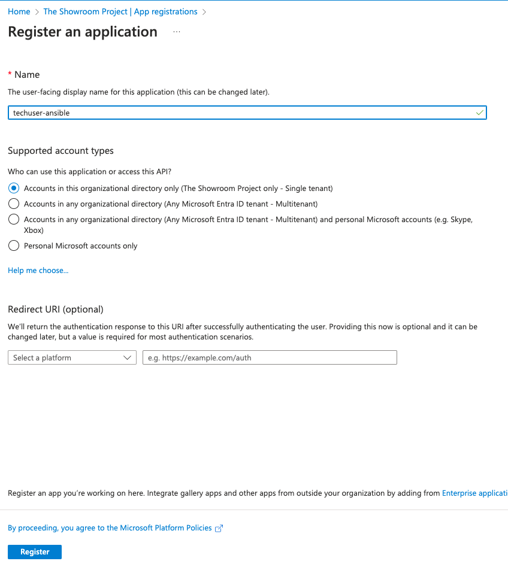
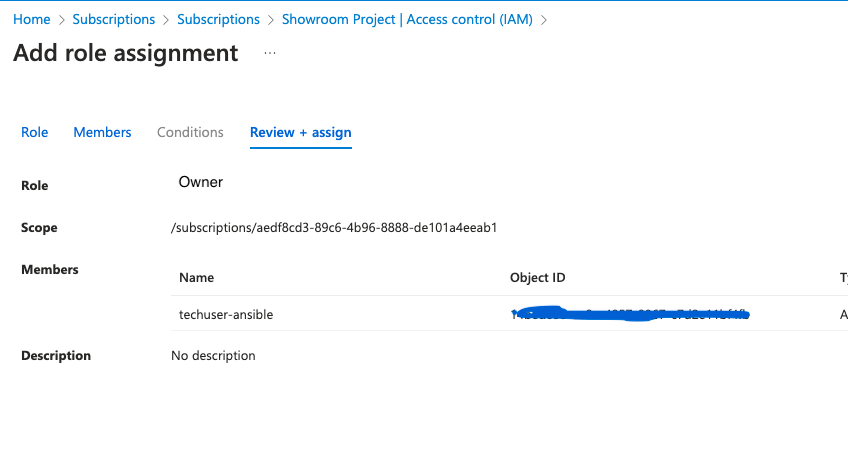
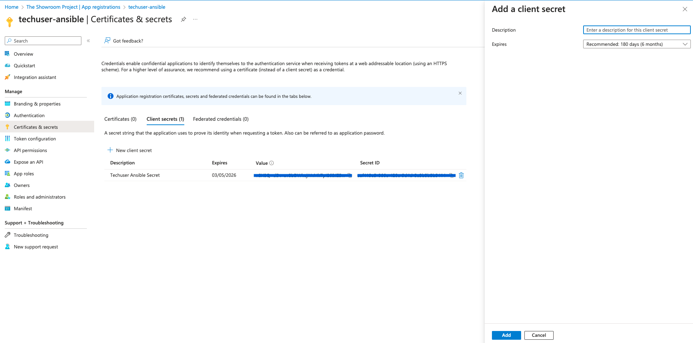

# Azure Ansible Integration

An Azure service principal is a security identity used by user-created
apps, services, and automation tools to access specific Azure resources.
Think of it as a *user identity* (login and password or certificate)
with a specific role, and tightly controlled permissions to access your
resources. It only needs to be able to do specific things, unlike a
general user identity. It improves security if you only grant it the
minimum permissions level needed to perform its management tasks. In our
case we need to create an custom app and grant OWNER access on
subscription level to perform ansible tasks. (Owner role is required to
lock the VM on Azure) These information are stored encrypted in
rhis-inventory repo

## Create Custom App

## Assign Contributor Role to App

## Create Secret

