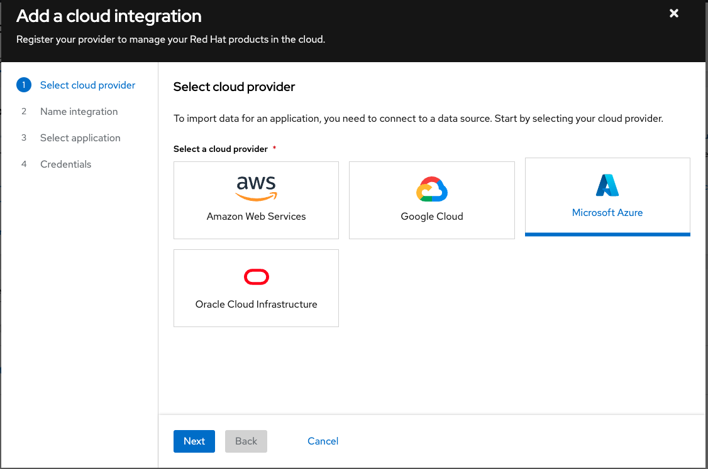
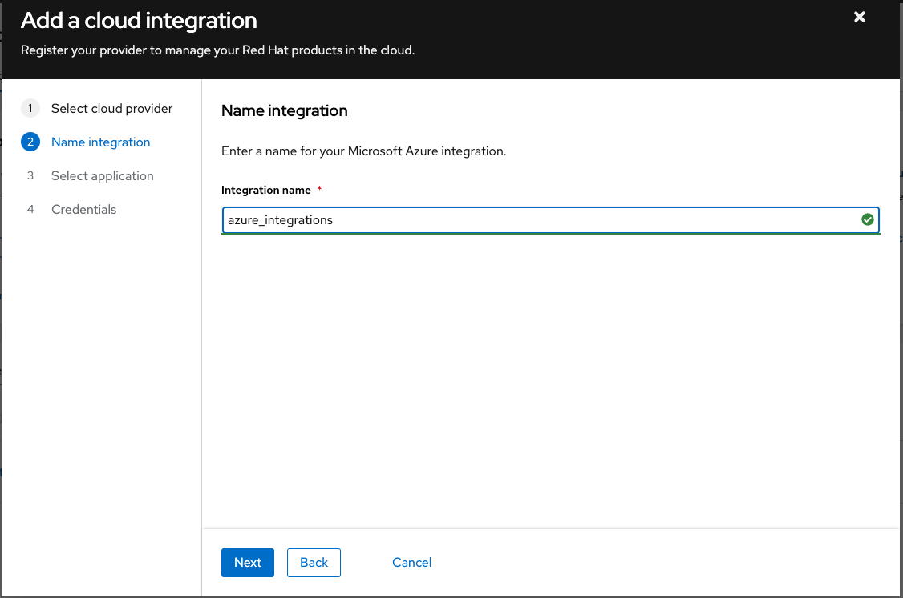
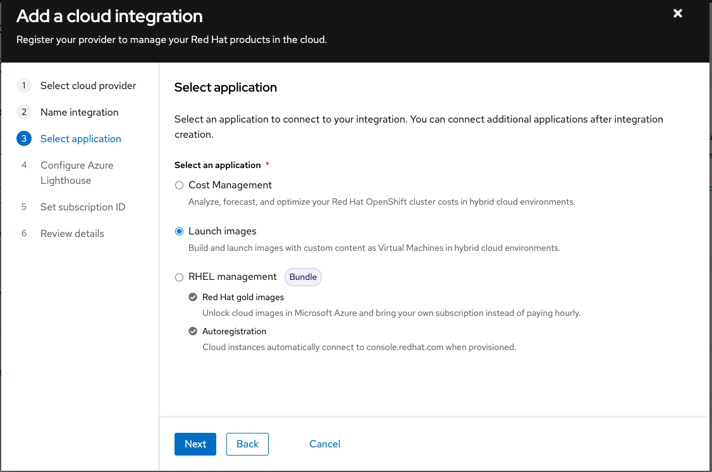
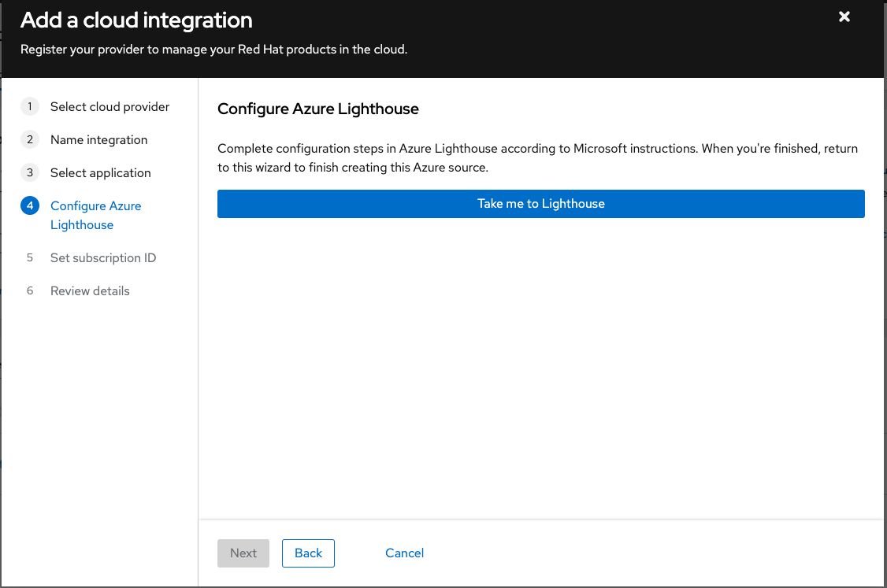
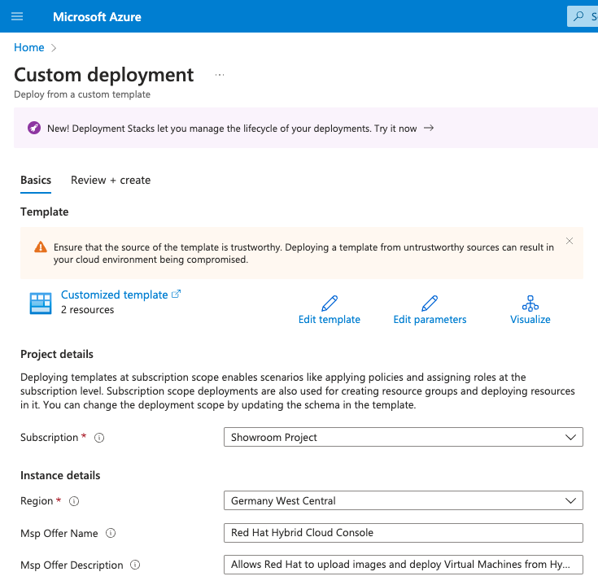
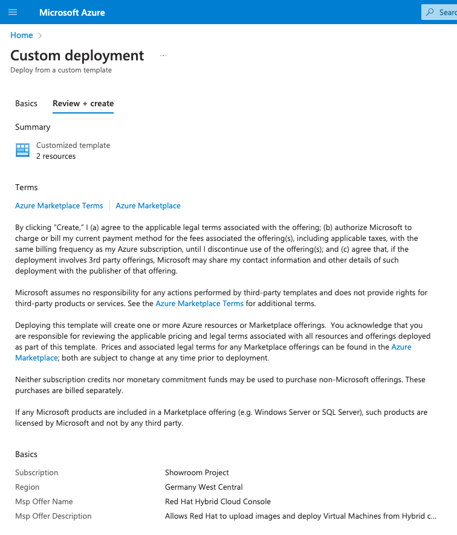
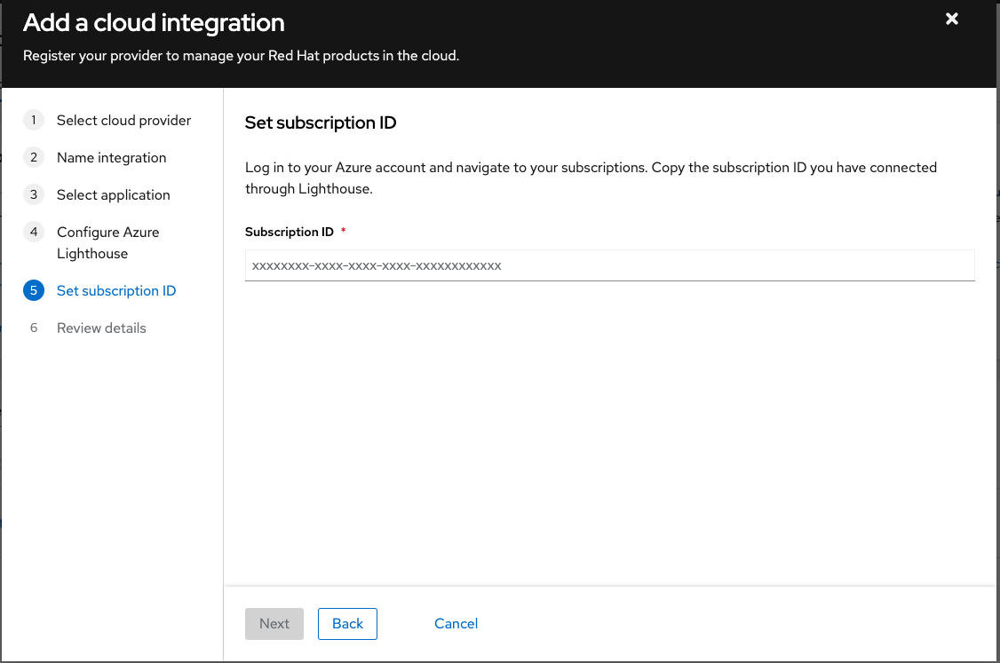
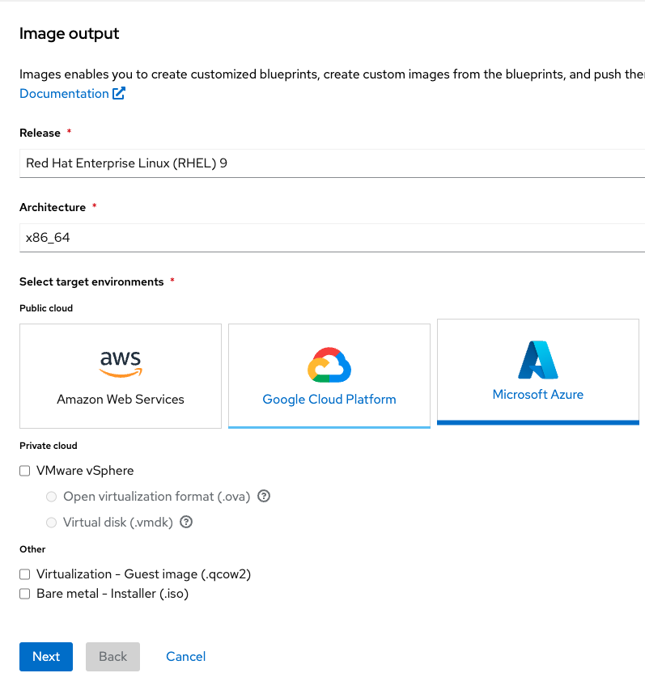
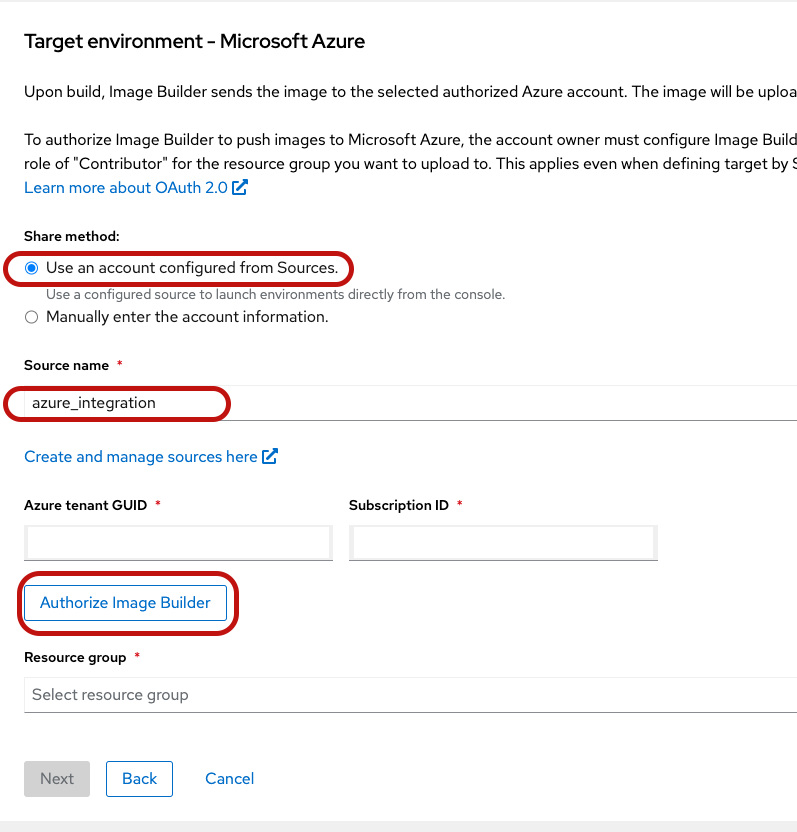
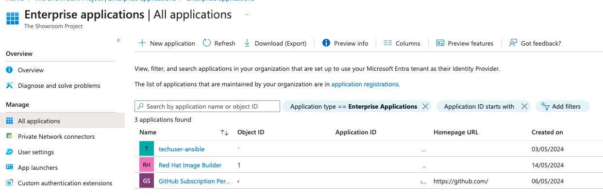

# Red Hat Image Builder

Insights image builder bundled with Insights enables you to create
customized images and upload the image to the target cloud environments.
Insights image builder is a tool bundled with Red Hat Insights within
Red Hat Hybrid Cloud Console.

During the bootstrap part of the infrastructure we aim to provision base
images using Insights Image builder and upload these golden images to
the public cloud provider Azure. Automation will cover building
customized system images, that can have a subscription activation key
already embedded and uploading these images to the Azure. Custom RHEL
images are created and used to build VMs for building core Red Hat
Management Infrastructure before having Red Hat Satellite provisioning
feature. To be able to upload these images to the Azure Red Hat Insights
Image Builder requires authorization from the Azure, and the document
covers how to grant this authorization.

# Red Hat Management Core Infrastructure

We can provision VMs on Azure (for any public provider or on-prem
baremetal systems) by using Red Hat Insights Image Builder tool to build
the core Red Hat Management Infrastructure.

We aim to provision the services below with this approach;

-   Jumpstart/ Bastion (RHEL 9)

-   PKI for root Certificate Authority (RHEL 9)

-   RHIdM VMs (RHEL 9)

-   Red Hat Satellite Server (RHEL 8)

# Build Integration between Red Hat Hybrid Cloud Console and Azure

1.  Ensure you have `Azure Tenant GUID` and `Subscription ID` to use

2.  Access to the
    [Integrations](https://console.redhat.com/settings/integrations)

3.  Click `Add Integration`

4.  Select `Microsoft Azure` and click `Next`

    <figure>
    
    </figure>

5.  Type a name for the integration like `azure_integration` and click
    `Next`

    <figure>
    
    </figure>

6.  Select `Launch images` from the list and click `Next`

    <figure>
    
    </figure>

7.  Click `Take me to Lighthouse` to be able to configure Azure for
    allowing this integration.

    <figure>
    
    </figure>

8.  Review and confirm `Subscription`, `Region`,
    `` Msp Offer Name`and `Msp Offer Description `` on the screen. If
    they seem correct click `Review + Create`

    <figure>
    
    </figure>

9.  Review and confirm Azure Marketplace Terms and click `Create`

    <figure>
    
    </figure>

10. Return to the previous window and type Azure `Subscription ID` on
    the screen and Click `Next`

    <figure>
    
    </figure>

11. Review and confirm the information and click `Add`

Red Hat Hybrid Cloud Console is integrated with Azure as a source.

# Authorize Image Builder

1.  Ensure that Red Hat Insights subscription exist your account. Red
    Hat Insights is included with your Red Hat Enterprise Linux
    subscription.

2.  Access to the [Insights image
    builder](https://console.redhat.com/insights/image-builder/)

3.  Log in with your Red Hat credentials.

4.  From the images select `Create Blueprint`

5.  Select `Azure` as a public cloud provider and click `Next`

    <figure>
    
    </figure>

6.  Select `Use an account configured from Sources.` option, and select
    the source name which was configured on the previous step.

    <figure>
    
    </figure>

7.  Click `Authorize image builder` to authorize Insights image builder
    to push images to the Microsoft Azure which will redirect you to the
    Azure portal where you can grant permissions by clicking `Accept`.
    You need to have `Owner` or `User Access Administrator` role and
    subscription must include `Microsoft.Storage` and
    `Microsoft.Compute` as a resource provider.

8.  Confirm that Insights Image Builder is authorized for your tenant.

    1.  Search for `Azure Entra ID` and choose **Enterprise
        applications**, from the left menu.

    2.  Search for `Red Hat Image Builder` and confirm it is authorized.

        <figure>
        
        </figure>

9.  Add the **Enterprise application** as a contributor to your
    `Subscriptions`.

    1.  In the search bar, type `Subscriptions` and select the
        subscription for the project. This redirects you to the
        `Subscriptions` dashboard.

    2.  Select your `Subscription`.

    3.  On the left menu, click `Access control (IAM)` to add a
        permission so the `Insights image builder` application can
        access to all your resource groups.

        <figure>
        
        </figure>

    4.  From the menu, click the tab `Role assignments`.

    5.  Click `Add`.

    6.  From the dropdown menu, choose `Add role assignment`. A menu
        appears on the left side.

    7.  Insert the following details:

        1.  Role: Assign the `Contributor role`

        2.  Assign access to: User, group, service principal. Add
            members: Click `Select members` and type `Red Hat` in the
            search bar. Press enter.

        3.  Select: `Red Hat Image Builder` application

The Insights Image Builder application is now authorized to push images
to Microsoft Azure cloud.

Detailed information provided by the official documentation in [Red Hat
Image
Builder](https://access.redhat.com/documentation/en-us/red_hat_enterprise_linux/8/html-single/creating_customized_images_by_using_insights_image_builder/index#creating-and-uploading-customized-rhel-system-image-to-azure-using-image-builder)
