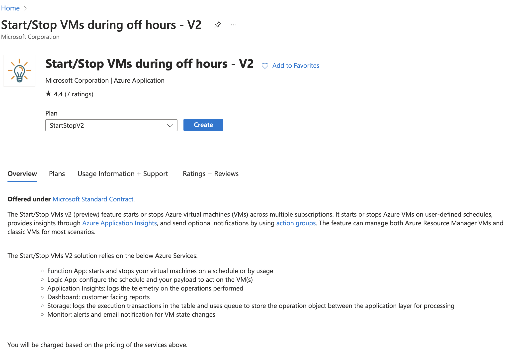
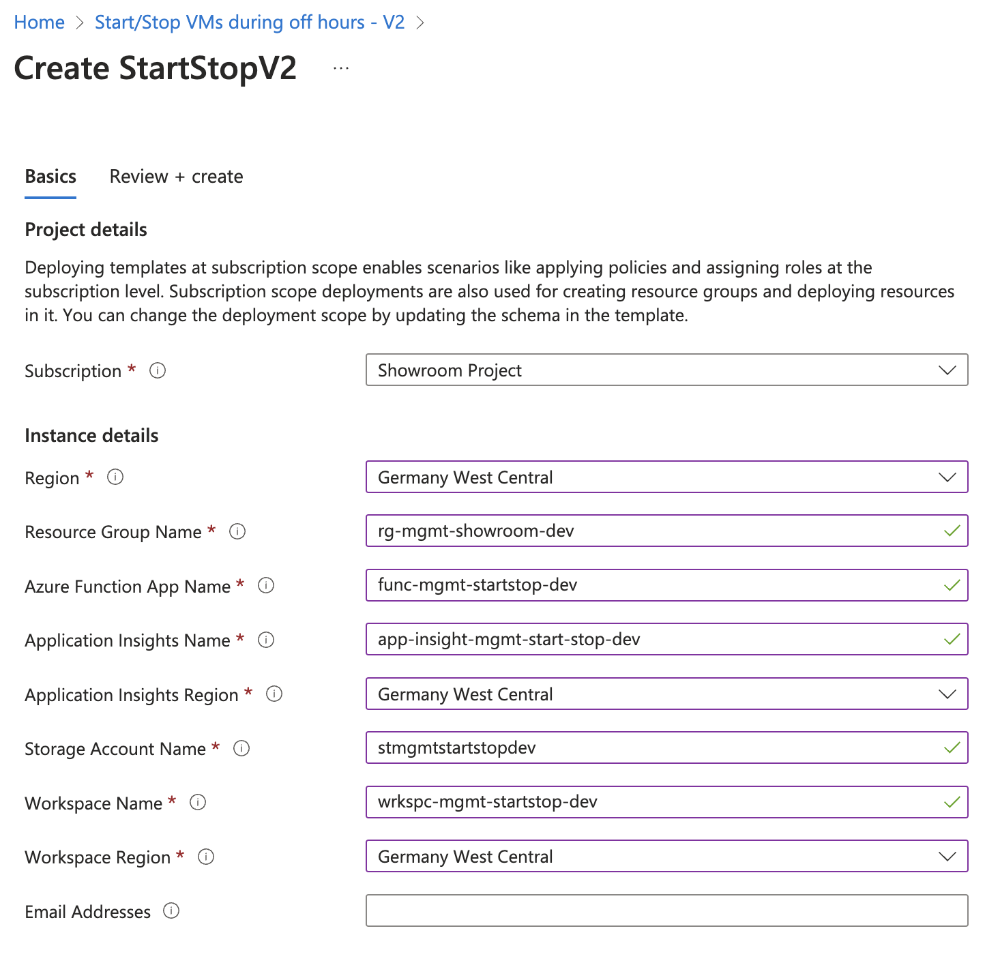
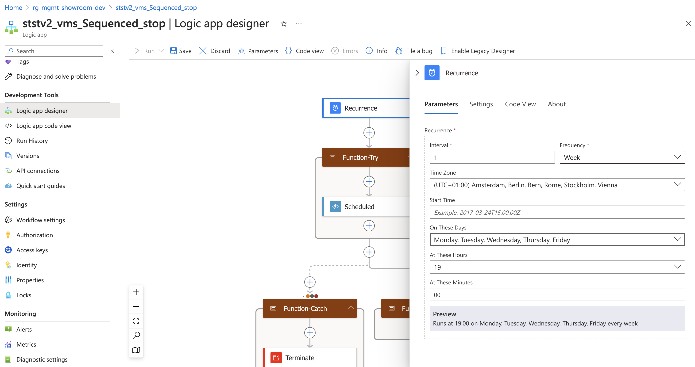
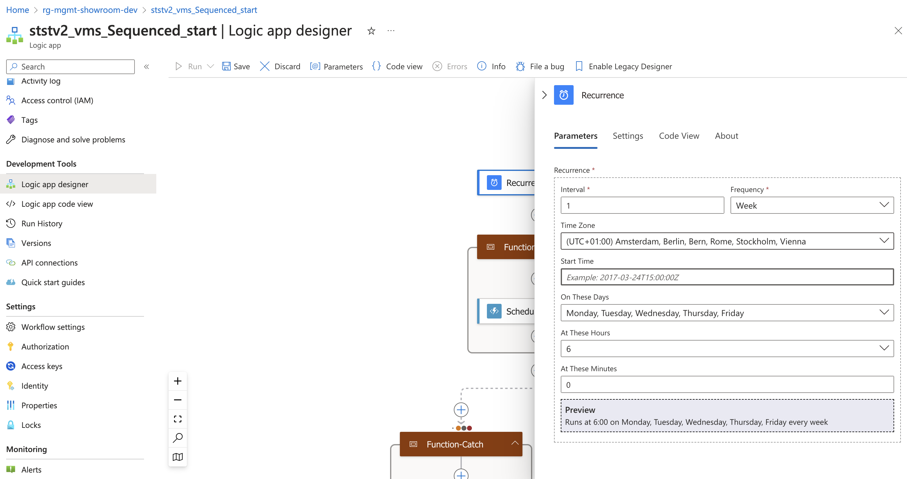
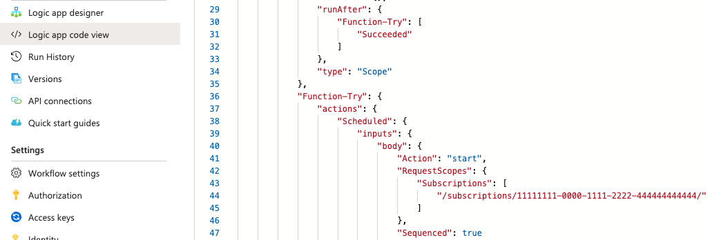

# Start stop VM's

In this project, we’re going to automate the code for building Red Hat Management Tools to manage and build a Red Hat based environment. Since
the environment isn’t going to be used for productive workloads, we’ve decided to use a built-in functionality from the Microsoft Azure
Marketplace called [start/stop VMs v2](https://learn.microsoft.com/en-us/azure/azure-functions/start-stop-vms/overview#overview).
This will help decrease cloud costs for non-development time slots in the project, such as evenings and weekends.

The `Start/Stop VMs v2` feature starts or stops Azure Virtual Machines instances across multiple subscriptions.

We’ve decided to take a different approach to the automation code development for this project. While this isn’t the main requirement, we’ve agreed to exclude this part and cover it with manual steps described in this document.

We have planned schedules for weekdays only that will start VMs automatically at 6:00 AM and shutdown at 7:00 PM (Europe/Berlin time zone).

# Deploy Start/Stop VMs v2

We followed mainly the official documentation for the [start/stop VMs v2](https://learn.microsoft.com/en-us/azure/azure-functions/start-stop-vms/overview#overview) function with great enthusiasm!

It is recommended to use separate resource group for deploying this application as it will create additional resources required for this function to work.

1. Deploy function from the marketplace.

{ align=centre }

2. Provide resource group, function, storage account and application insights names.

{ align=centre }

3. After Deployment configure schedule for the sequenced stop.

{ align=centre }

4. Configure schedule for the sequenced start.

5. Correct subscription information in the `Logic app code view` for the logic applications named `ststv2_vms_Sequenced_stop` and `ststv2_vms_Sequenced_start`

{ align=centre }

6. Enable Azure Function for the logic applications named `ststv2_vms_Sequenced_stop` and `ststv2_vms_Sequenced_start`

# How to Configure VMs

Sequenced - Start and stop actions are based on a schedule targeting VMs
with pre-defined sequencing `tags`. Only two named tags are supported -
`sequencestart` and `sequencestop`. ststv2\_vms\_Sequenced\_start and
ststv2\_vms\_Sequenced\_stop configure the sequenced start and stop.

The proper way to use the sequence functionality is to create a tag
named `sequencestart` on each VM you wish to be started in a sequence.
The tag value needs to be an integer ranging from 1 to N for each VM in
the respective scope. The tag is optional and if not present, the VM
simply won’t participate in the sequencing. The same criteria applies to
stopping VMs with only the tag name being different and use
`sequencestop` in this case. You have to configure both the tags in each
VM to get start and stop action. If two or more VMs share the same tag
value, those VMs would be started or stopped at the same time.

For example, the following table shows that both start and stop actions
are processed in ascending order by the value of the tag.

<table>
<colgroup>
<col style="width: 33%" />
<col style="width: 33%" />
<col style="width: 33%" />
</colgroup>
<thead>
<tr class="header">
<th style="text-align: left;">VM Name</th>
<th style="text-align: left;">Tags</th>
<th style="text-align: left;">Action Order</th>
</tr>
</thead>
<tbody>
<tr class="odd">
<td style="text-align: left;">
VM 1
</td>
<td style="text-align: left;">
sequence start: 1 / sequence stop:
2
</td>
<td style="text-align: left;">
Start: VM1, VM2
</td>
</tr>
<tr class="even">
<td style="text-align: left;">
VM 2
</td>
<td style="text-align: left;">
sequence start: 2 / sequence stop:
1
</td>
<td style="text-align: left;">
Stop: VM2, VM1
</td>
</tr>
</tbody>
</table>

## VM Tags

Tags must be set on the VMs to include or exclude specific VMs from
start and stop actions. Add a tag named `ssv2excludevm` in the
configuration for the VM. To exclude this VM from the start or stop
action, set the value of this new tag to `true`. To include the VM in
the action, set the value to false or don’t use any exclusion tag.

# VMs sequence Order

<table>
<colgroup>
<col style="width: 33%" />
<col style="width: 33%" />
<col style="width: 33%" />
</colgroup>
<thead>
<tr class="header">
<th style="text-align: left;">VM Name</th>
<th style="text-align: left;">Start Sequence</th>
<th style="text-align: left;">Stop Sequence</th>
</tr>
</thead>
<tbody>
<tr class="odd">
<td style="text-align: left;">
RHIdM (Primary)
</td>
<td style="text-align: center;">
1
</td>
<td style="text-align: center;">
5
</td>
</tr>
<tr class="even">
<td style="text-align: left;">
RHIdM (Replica)
</td>
<td></td>
<td></td>
</tr>
<tr class="odd">
<td style="text-align: left;">
NBDE (Primary)
</td>
<td></td>
<td></td>
</tr>
<tr class="even">
<td style="text-align: left;">
NBDE (Replica)
</td>
<td></td>
<td></td>
</tr>
<tr class="odd">
<td style="text-align: left;">
RH Satellite
</td>
<td style="text-align: center;">
2
</td>
<td style="text-align: center;">
4
</td>
</tr>
<tr class="even">
<td style="text-align: left;">
RH Keycloak
</td>
<td></td>
<td></td>
</tr>
<tr class="odd">
<td style="text-align: left;">
RH Bastion
</td>
<td style="text-align: center;">
3
</td>
<td style="text-align: center;">
3
</td>
</tr>
<tr class="even">
<td style="text-align: left;">
AAP PGSQL
</td>
<td></td>
<td></td>
</tr>
<tr class="odd">
<td style="text-align: left;">
AAP Controller
</td>
<td style="text-align: center;">
4
</td>
<td style="text-align: center;">
2
</td>
</tr>
<tr class="even">
<td style="text-align: left;">
AAP PAH
</td>
<td></td>
<td></td>
</tr>
<tr class="odd">
<td style="text-align: left;">
AAP EE
</td>
<td></td>
<td></td>
</tr>
<tr class="even">
<td style="text-align: left;">
AAP HOP
</td>
<td></td>
<td></td>
</tr>
<tr class="odd">
<td style="text-align: left;">
AAP EE on DMZ
</td>
<td></td>
<td></td>
</tr>
<tr class="even">
<td style="text-align: left;">
Capsule on DMZ
</td>
<td></td>
<td></td>
</tr>
<tr class="odd">
<td style="text-align: left;">
Workload VMs
</td>
<td style="text-align: center;">
5
</td>
<td style="text-align: center;">
1
</td>
</tr>
<tr class="even">
<td style="text-align: left;">
Workload VMs on DMZ
</td>
<td></td>
<td></td>
</tr>
<tr class="odd">
<td style="text-align: left;">
RootCA
</td>
<td colspan="2" style="text-align: center;">
ssv2excludevm
</td>
</tr>
</tbody>
</table>
