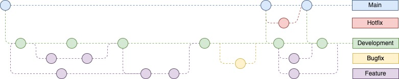

# Branch Standards

GitHub helps us manage our codebase efficiently by employing a
structured branch management strategy that aligns with our diverse use
cases. These branches ensure smooth coordination among development teams
and contributors.

In this project branching strategy tries to emulate Github flow. Project
contains two repositories;

-   Code repository for roles, collections, playbooks

-   Inventory repository for managed infrastructure and clients;
    parameters for infrastructure and client groups, as well as global
    parameters

## Branch Naming Convention

-   Feature Branches: feature-&lt;Jira ticket number&gt;

-   Bugfix Branches: bugfix-&lt;Jira ticket number&gt;

-   Hotfix Branches: hotfix-&lt;Jira ticket number&gt;

Contributors create their feature branches with Jira ticket number. As
most features are expected to introduce new parameters in the inventory,
the common approach is to create a similar named branch in both
repositories (i.e. code and inventory).

In both repositories:

-   production branch (`main`) is locked to be updated manually. It can
    be updated only thru Pull Request(PR) from development branch. The
    main branch should always reflect the production-ready state of the
    codebase. It should only contain code that has been thoroughly
    reviewed, tested, and approved for deployment.

-   development branch(`devel`) serves as the main integration branch
    where features are merged before being deployed to production.
    Developers should base their feature branches off the development
    branch.

-   feature branches should be self-contained. They need to be tested on
    their own before merging to development. feature branches can be
    merged to development thru Pull Request(s) following a review for
    the request.

-   bugfix branches should address issues found during testing and
    development. These branches should be tested and merged into
    development branch.

-   hotfix branch can be created directly from the master branch in the
    event of a critical bug or issue in production. Hotfixes should be
    kept minimal to reduce the risk of introducing new problems. Once
    the hotfix is completed, it should be merged into both the master
    and development branches.

## Pull Requests

When a developer completes work on a feature branch, they create a pull
request (PR) to merge their changes into the development branch. Usually
two merge requests are required, one for the code and one for the
inventory repository. The PR should include a detailed description of
the changes made, any relevant screenshots or documentation updates, and
any associated issue numbers. Other team members review the code,
provide feedback, and discuss any necessary changes before the PR is
merged. All conversations must be resolution before merging.

## Code Reviews

Code reviews are essential for maintaining code quality and ensuring
consistency across the codebase. Reviewers should focus on readability,
maintainability, efficiency, and adherence to coding standards.
Constructive feedback should be given with the goal of improving the
code. It is expected that the branch has been re-based against the
target branch as to avoid conflicts resolution for the reviewer(s). 2
reviewers are required to approve pull requests. Approvals will be
discarded for the PR if a new commit push exists after review and
approval.

## Continuous Integration (CI)

CI systems automatically build and test code changes whenever a new
commit is made or a PR is opened. Automated tests should be run to
ensure that new code does not introduce regressions or break existing
functionality. CI checks should pass before a PR can be merged.

## Pull Request Merge

Pull requests are merged automatically in development branch(`devel`)
when;

* approval of 2 reviewers exist
* all conversations are resolved
* all checks have passed

## Branch Rule Sets

Branch rule sets are configured to align with our branching standards on
GitHub and detailed configuration is accessible by the repository
ruleset links below:

* [rhis-code repository rulesets](https://github.com/redhat-cop/rhis-code/rules)
* [rhis-inventory repository rulesets](https://github.com/redhat-cop/rhis-inventory/rules)
