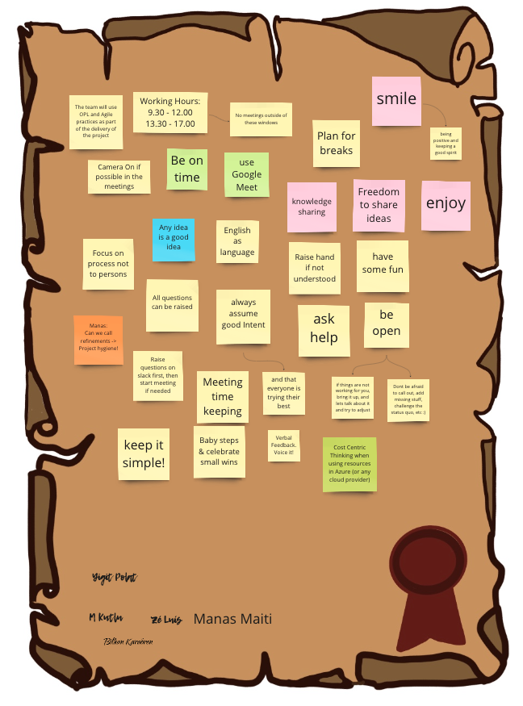

# Azure cost estimation

This document explains general guidelines for the project to work
together. We all have agreed to work with Agile methodology and also
using Open Practices in the project. Social contract is the important
part for building open framework between people in the project.

{ align=centre }

# User Stories

We use internal JIRA to follow-up user stories, tasks, epics in the
project with agile approach. See
[JIRA](https://issues.redhat.com/secure/RapidBoard.jspa?rapidView=19625&projectKey=SHWRM&view=planning&issueLimit=100)
for the user stories and planning.

## Definition of Ready

### Independent

Whatever backlog item you’re working on must not depend on any other
task. It must be self-contained. Your team will avoid any unnecessary
work this way.

### Negotiable

A task shouldn’t be rigid. You must be flexible enough to consider other
options the team might bring.

### Valuable

There must be a purpose to your work. More importantly, it must add
value to the product, the customer, and the business.

### Estimable

The task must be feasible, achievable, and measurable. Your team needs
to know how much time and effort you will require of them. If the sprint
requires multiple tasks, the same goes for each.

### Small

The work must be manageable. If a task is complex, you should be able to
break it down into smaller ones. Doing so prevents fire drills and
working in overdrive to meet unreasonable deadlines. And your team won’t
burn out.

### Testable

Specify the success and completion criteria based on business and user
needs. These allow your team to evaluate whether the task is complete.

## Definition of Done

1.  Keep it Simple!

2.  MRs reviewed at least by 2 persons - 4 eyes principle.

3.  All issues solved within Merge request Review.

4.  Merge requests points jira tickets.

5.  All pipelines passed successfully.

6.  All Ansible code written idempotent allows same results when
    executed more than once.

7.  Test steps clearly described and proof attached.

8.  Documented clearly.

## Backlog Guidelines

1.  All "STORIES" and "TASKS" are associated with an "EPIC" type issue
    that logically represents all that needs to be down under a specific
    context.

2.  "STORY" type issues shall be used to represent direct value to the
    customer. As such the persona of such issue is always the customer.

3.  "TASK" type issues shall be used to represent either admin-like
    tasks or technical tasks that do not represent direct value to the
    customer.

4.  "SUB-TASK" type issues shall be used break down stories or tasks. Do
    keep in mind they do not appear directly in the backlog. Use them as
    a way to organize the issues you own.

5.  The pre-fix \[P\] present on the name of an issue in JIRA, means
    that the issue is "Prepared" for refinement and can thus be reviewed
    by the team.

6.  The pre-fix \[R\] present on the name of an issue in JIRA, means
    that the issue is "Refined/Ready" to be taken into a sprint.

7.  Any member of the Core Implementation team can and is encouraged to
    add any issues that they feel relevant to the backlog for future
    refinement.

8.  Backlog Items will be estimated by complexity with the usage of the
    Fibonacci sequence.

9.  Prioritization of the backlog is of the sole responsibility of the
    acting PO (José Costa) and the backlog should be prioritized as part
    of the refinement and planing events.

# Git Cheat Sheet

A quick introduction into the proposed git workflow can be found [Git
Cheat Sheet for Developers](git_cheat_sheet.md). For the structuring
of contents inside of your branch, please have a look at the automation
link below.

# Branch Standards and Review Process

See [Branch Standards](branch_standards.md), to learn more about how
to work with git branches.

# IDE

You can you any IDE you like in the project but we strongly recommend to
use `VSCode` to benefit already developed extensions that will make your
life easier. It is good to use VSCode with a remote SSH support using
Bastion to access to the project infrastructure resources. Using
ansible-lint on your local or remote Bastion VM would be beneficial
before you push your commits to GitHub.

Following are the recommended Extensions on VSCode to use.

-   `Ansible`
-   `AsciiDoc`
-   `Git History`
-   `Git Graph`
-   `GitHub Actions`
-   `GitHub Pull Requests`
-   `GitHub Repositories`
-   `Markdown Theme Kit`
-   `Red Hat Authentication`
-   `Red Hat Commons`
-   `Remote - SSH`
-   `Remote - SSH Editing Configuration Files`
-   `Remote Development`
-   `Remote Explorer`
-   `Trailing Spaces`
-   `TODO Highlight`
-   `YAML`

Ansible Lightspeed can be used for the code assistance with VSCode as well, refer to the [Ansible VS Code extension](https://docs.ai.ansible.redhat.com/vscode_guide/installing_vs).

# Documentation

Write your documentation in a way that keeps it readable in the editor
*and* in its rendered form.

We generally use [Asciidoc](https://asciidoctor.org/) or [Markdown](https://www.markdownguide.org/) for documentation and we place it under revision control in our Git as near as possible to the code it documents. Readme-files in roles and inventories, however, are written in markdown (see note below). Create a `README.adoc` in each applicable directory to describe the content / structure of the repository, because GitHub will render it when opening the directory.

Within inventories we use markdown `README.md` files. Ansible doesn’t ignore Asciidoc files when parsing inventories and will produce a warning.

Independent of the choice of markup language, the following rules apply:

1. Use (inline) code highlighting for
    1.  file names
    2.  variable names and other Ansible objects such as tags, role names, module names, etc.
    3.  command line examples
    4.  host names
2.  Code block delimiters specify the language. For example, a YAML block is started with `[source,yaml]` in Asciidoc (\`\`\`\`yaml\` in
    Markdown). Use `bash` highlighting for example Ansible cli commands
3.  Do not use spaces in front of list item indicators such as `\*` and `-`
4.  Code blocks are marked explicitly (four or more dashes in Asciidoc,three back-ticks in MD). Do *not* use indentation to mark them as code blocks.
5.  Internal links to files in the code repository are linked directly and not through version control system address. Use `+link:file.adoc[descriptive name]+` instead of the full static URL including server name etc.
6.  Do NOT link *directly* to the `README.adoc` files but to the directory containing it, it makes it easier to navigate in GitHub.
7.  Add `TODO:` in the document if there is any sections needs to done later to not forget.

# Ansible Code Bot

The Ansible code bot scans existing content collections, roles, and
playbooks hosted in GitHub repositories, and proactively creates pull
requests whenever best practices or quality improvement recommendations
are available.

Ansible code bot scans our repositories to recommend code quality
improvements. It promotes Ansible best practices while avoiding common
errors that can lead to bugs or make code harder to maintain.

We agreed to enable Ansible code bot on our GitHub repository to benefit
from the AI to improve our code during the development stages. Scheduled
scans are configured on a weekly basis
[Ansible Code bot](../.github/ansible-code-bot.yml)

Installing and Configuring Ansible Code Bot explained in the [official
Red Hat
documentation](https://access.redhat.com/documentation/en-us/red_hat_ansible_lightspeed_with_ibm_watsonx_code_assistant/2.x_latest/html/red_hat_ansible_lightspeed_with_ibm_watsonx_code_assistant_user_guide/using-code-bot-for-suggestions_lightspeed-user-guide#doc-wrapper).

# GitOps with Ansible Approach

Details for GitOps with Ansible and Infrastructure as a Code approach
are explained in [GitOps with Ansible](gitops_ansible.md) document.

# Configure Local Workstation to use Bastion

To configure your local workstation to be able to work remotely see [Configure Local Workstation to use Bastion](configure_workstation_for_bastion.md)
