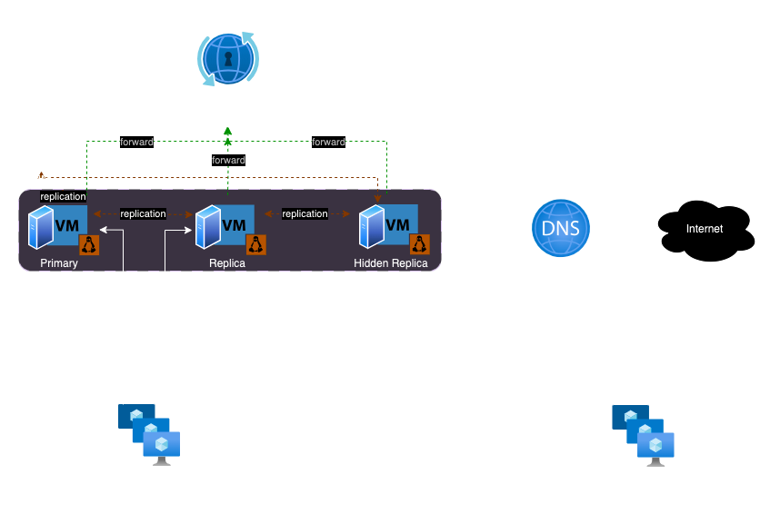

# Identity Management Architecture

Red Hat Identity Management (RHIdM) is an integrated solution for
centrally managing the authentication, authorization, and identity
information of users, hosts, and services within an organization. This
document outlines the design and architecture of a RHIdM deployment
consisting of one primary server, one replica server, and one hidden
replica server. IdM is responsible for providing identity services for
all RHEL systems. IdM will centralize management of users, groups,
hosts, access control rules, and certificates.

IdM Terminology is available on the official
[documentation](https://access.redhat.com/documentation/en-us/red_hat_enterprise_linux/9/html/planning_identity_management/overview-of-planning-for-identity-management-and-access-control-planning-identity-management#IdM_terminology_overview-of-planning-idm-and-access-control).

## Architecture diagram

{ align=centre }

### System Configuration

1.  x86\_64 architecture
2.  The latest version of Red Hat Enterprise Linux 9
3.  2-core CPU at a minimum
4.  8GB of RAM
5.  fully qualified hostname
6.  Azure virtual instance `D2s_v4`
7.  high-bandwidth, low-latency storage, with standard or premium SSD type disk with 50 GB space
8.  Will be deployed in `Infra management network` in Azure

### IdM clients

IdM clients are Red Hat Enterprise Linux systems enrolled with the
servers and configured to use the IdM services on these servers.

Clients interact with the IdM servers to access services provided by
them. For example, clients use the Kerberos protocol to perform
authentication and acquire tickets for enterprise single sign-on (SSO),
use LDAP to get identity and policy information, use DNS to detect where
the servers and services are located and how to connect to them.

### IdM servers

IdM servers are Red Hat Enterprise Linux systems that respond to
identity, authentication, and authorization requests within an IdM
domain. IdM servers will also host any of the following services used by
domain members:

-   Certificate authority (CA)
-   Key Recovery Authority (KRA)
-   DNS
-   Active Directory (AD) trust controller
-   Active Directory (AD) trust agent

These services are all integrated and managed in a cohesive way through
the web management interface and CLI. Through these services, it is
possible to centrally define and enforce a variety of policies and
roles, such as:

1.  Directory service
2.  Host-based access control (which users/groups can access which services on which systems)
3.  Role-based access control (sudo rules)
4.  SELinux user maps
5.  NFS server auto maps (home directory and other automounts)

### Replicas

Continuous functionality and high availability of Identity Management
(IdM) services is vital for users who access resources. One of the
built-in solutions for accomplishing continuous functionality and high
availability of the IdM infrastructure through load balancing is the
replication of the central directory by creating replica servers of the
first server.

IdM uses multiple read/write replica replication. In this configuration,
all replicas joined in a replication agreement receive and provide
updates, and are therefore considered suppliers and consumers.
Replication agreements are always bilateral.

The following two types of replication agreements will be setup:

-   **Domain replication agreements**: These agreements replicate the identity information.
-   **Certificate replication agreements**: These agreements replicate the certificate information

### Hidden Replicas

By default, when you set up a replica, the installation program
automatically creates service (SRV) resource records in DNS. These
records enable clients to auto-discover the replica and its services. A
hidden replica is an IdM server that has all services running and
available. However, it has no SRV records in DNS, and LDAP server roles
are not enabled. Therefore, clients cannot use service discovery to
detect these hidden replicas.

All server roles used in a cluster, especially the Certificate Authority
role if the integrated CA is used, must be installed on the hidden
replica for the backup to be able to restore those services.

## Security Management

### SElinux

SELinux enabled as a system default on Red Hat IdM servers.

### FIPS Mode

FIPS mode must be enabled on the system before Red Hat IdM installation. Please refer to the [official
documentation](https://access.redhat.com/documentation/en-us/red_hat_enterprise_linux/9/html/installing_identity_management/preparing-the-system-for-ipa-server-installation_installing-identity-management#fips_compliance).

### Certificates

Certificate authorities operate in a hierarchy of trust. Red Hat IdM
Server will use an integrated certificate signed by an external root
certificate authority (CA). IdM will also act as a certificate provider
for other services hence it will add a certificate to the chain/bundle.

The role of the CA includes the following purposes:

-   It issues digital certificates.
-   By signing a certificate, it certifies that the subject named in the certificate owns a public key. The subject can be a user, host or service.
-   It can revoke certificates, and provides revocation status via Certificate Revocation Lists (CRLs) and Online Certificate Status Protocol(OCSP).

### Random serial numbers in IdM

With Random Serial Numbers version 3 (RSNv3) enabled, IdM generates
fully random serial numbers for certificates and requests in PKI without
range management. A variable named `ipaserver_random_serial_numbers`
must be set on the deployment role with ansible. it is required to use
RSNv3 on all public-key infrastructure (PKI) services in the deployment,
including the CA and Key Recovery Authority (KRA). A check is performed
when KRA is installed to automatically enable RSNv3 if it is enabled on
the underlying CA.

For more information please refer to [Installing an IdM server: With
integrated DNS, with an external CA as the root
CA](https://access.redhat.com/documentation/en-us/red_hat_enterprise_linux/9/html/installing_identity_management/installing-an-ipa-server-with-external-ca_installing-identity-management).

## DNS

In the environment we plan to use already existing private DNS server,
which we plan to delegate only the IdM primary domain to the DNS
integrated with IdM. It is not necessary to migrate DNS zones to the IdM
DNS.

Ensure you have valid delegation in the public DNS tree for the DNS
domain. Do not use a domain name that is not delegated to you, not even
on a private network.

<table>
<colgroup>
<col style="width: 50%" />
<col style="width: 50%" />
</colgroup>
<thead>
<tr class="header">
<th style="text-align: left;">DNS Name</th>
<th style="text-align: left;">internal.showroom.run</th>
</tr>
</thead>
<tbody>
<tr class="odd">
<td style="text-align: left;">
IdM Domain
</td>
<td style="text-align: left;">
internal.showroom.run
</td>
</tr>
<tr class="even">
<td style="text-align: left;">
Kerberos Realm Name
</td>
<td style="text-align: left;">
INTERNAL.SHOWROOM.RUN
</td>
</tr>
</tbody>
</table>

DNS delegation from the parent domain to the IdM DNS domain must be
granted. Add a name server (NS) record to the `showroom.run` parent
domain for the `internal.showroom.run`

Each IdM will manage the DNS records for the sub-domain
`internal.showroom.run`. This domain will be delegated in the domain
name-servers.

### DNS Forwarders

DNS forward policy must be set to Azure DNS IP in IdM to allow internal
clients to be able to resolve internet addresses.

**Forward first** (default): The IdM BIND service forwards DNS queries
to the configured forwarder. If a query fails because of a server error
or timeout, BIND falls back to the recursive resolution using servers on
the Internet.

<table>
<colgroup>
<col style="width: 50%" />
<col style="width: 50%" />
</colgroup>
<thead>
<tr class="header">
<th style="text-align: left;">Forward Policy</th>
<th style="text-align: left;">Forward IP</th>
</tr>
</thead>
<tbody>
<tr class="odd">
<td style="text-align: left;">
Forward first
</td>
<td style="text-align: left;">
168.63.129.16
</td>
</tr>
<tr class="even">
<td style="text-align: left;">
DNS Forward Zone
</td>
<td style="text-align: left;">
showroom.run
</td>
</tr>
</tbody>
</table>

## Time Servers

It is possible use `chronyd` to keep IdM hosts in sync with a central
time source. Kerberos, the underlying authentication mechanism in IdM,
uses time stamps as part of its protocol. Kerberos authentication fails
if the system time of an IdM client differs by more than five minutes
from the system time of the Key Distribution Center (KDC). All VMs use
chrony configuration and able synchronize time from the public time
servers. The default config used for RHEL systems for defining the pool
of `pool 2.rhel.pool.ntp.org`.

## Components and communication

Red Hat IdM consists of several underlying communication from clients to
the server, including

1.  LDAP directory service
2.  Kerberos KDC service
3.  DNS service
4.  Certificate authority service
5.  Key Recovery Authority

## High Availability and Backup

A good disaster recovery strategy combines the following tools to
recover from a disaster as soon as possible with minimal data loss:

### Replication

Replication copies database contents between IdM servers. If an IdM
server fails, you can replace the lost server by creating a new replica
based on one of the remaining servers.

As we plan to use CA, KRA and DNS functionalities on RH IdM, we must
ensure that replica server also has sane features enabloed for the high
availability.

### IdM backups

The ipa-backup utility allows you to take a backup of an IdM server’s
configuration files and its data. You can later use a backup to restore
an IdM server to a previous state.

IdM provides the `ipa-backup` utility to backup IdM data, and the
`ipa-restore` utility to restore servers and data from those backups.

There are two backup types:

1.  Full server backup
    1.  Contains all server config data along with LDAP data
    2.  IdM services must be `offline`
2.  Data only backup
    1.  Contains only LDAP data
    2.  IdM services can be `offline` or `online`

It is preferred to have `Full server backup` once every week in case we
need to build it from scratch. We consider performing backups on hidden
replicas. IdM services can be shut down on hidden replicas without
affecting IdM clients.

Refer to the [RH official
documentation](https://access.redhat.com/documentation/en-us/red_hat_enterprise_linux/9/html/preparing_for_disaster_recovery_with_identity_management/preparing-for-data-loss-with-idm-backups_preparing-for-disaster-recovery)
for preparing for data loss with IdM backups.

## Features and Functionality

### Auto Membership

Using automatic group membership allows you to assign users and hosts to
groups automatically based on their attributes. Automember rules apply
automatically to user and host entries created after the rules were
added. They are not applied retroactively to entries that existed before
the rules were added.

### Role-Based Access Control (RBAC) and Host-Based Access Control (HBAC)

Host-based access control (HBAC) rules define which users or user groups
can access specified hosts or host groups by using which services or
services in a service group. By default, IdM is configured with a
default HBAC rule named `allow_all`, which allows universal access to
every host for every user via every relevant service in the entire IdM
domain. `allow_all` rule must be disabled / removed after creating rule
with our own set of HBAC rules.

Role-based access control (RBAC) in IdM grants a very different kind of
authority to users compared to self-service and delegation access
controls.

Role-based access control is composed of three parts:

-   Permissions grant the right to perform a specific task such as
    adding or deleting users, modifying a group, and enabling
    read-access.
-   Privileges combine permissions, for example all the permissions
    needed to add a new user.
-   Roles grant a set of privileges to users, user groups, hosts or host
    groups.

### IdM location

IdM DNS locations to allow clients to locate authentication servers
within the closest network infrastructure.

### Self-service Rules

Self-service access control rules define which operations an Identity
Management (IdM) entity can perform on its IdM Directory Server entry.
After the deployment it is planned to setup self-service rules which
will help the new Users that they can manage their own name details rule
grants users the ability to change their own `givenname`, `displayname`,
`title`, `jpegphoto`, `description` and `initials` attributes.

### Two-Factor Authentication (2FA)

Two-factor authentication using One-Time Passwords (OTP) will be
configured to enhance security.

### Kerberos Single Sign-On (SSO)

Kerberos SSO will be implemented to allow users to authenticate once and
access multiple services without re-entering credentials.
