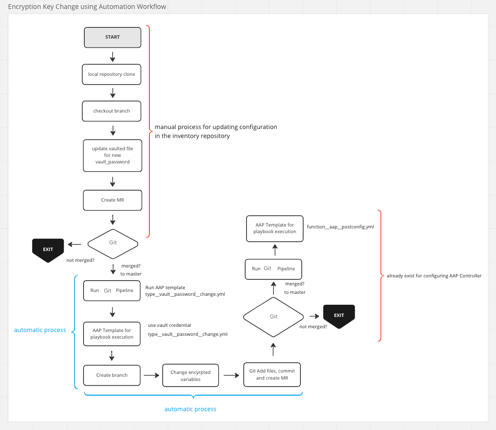

# Manage credentials in Ansible

`Credentials` are kept in the repository in a vaulted file. There
was some disadvantage to this design. One of it, we couldn’t search for
the variable name because they were kept in encrypted files.

## How are credentials managed now

The new structure has encrypted variables in the file named with the `vaulted` prefix. All existing encrypted variables are kept in the `inventory` repository under `group\_vars` and `host\_vars`. This way, variables do not show as clear text when AAP inventory syncs. All variables are shown as encrypted variables. A vault password is required to decrypt these encrypted variables.

As an example, the AAP group\_vars structure is shown below. A variable file to keep variables in clear text that is named
`aap\_data.yml`. Also, another file to keep encrypted variables is named `vault\_aap\_data.yml`.

    # [host] ~/git/inventory $ tree group_vars/aap/
    group_vars/aap/
    |-- aap_credential_data.yml
    |-- aap_data.yml
    |-- aap_inventory_data.yml
    |-- aap_project_data.yml
    |-- saml_settings.json
    |-- vault_aap_data.yml

    # [host] ~/git/inventory $ cat group_vars/aap/vault_aap_data.yml | head -7
    aap_registry_username: !vault |
              $ANSIBLE_VAULT;1.1;AES256
              30373732326232383162323862613535666366616161623536366338636538363831386431643639
              3861333964346661396631303836626538613766326331640a373033383236666637613830303135
              33303736313936313234643665653164666637373962653837363932323736333639623639653764
              6135366161313939390a326439393434333561393738623238386262663461303262623330366438
              6264

    # [host] ~/git/inventory $ cat group_vars/aap/aap_data.yml | head -3
    rhs_repository_base_url: "http://{{ rhs_satellite_server }}/pulp/isos/{{ rhs_org_name }}/Library/ccv_aap/custom/prod_aap_setup/"
    rhs_repository_short_name: "repo_aap_22_setup_file_rhel8"
    aap_release_version: "2.2.0-6"

## How to create encrypted variable

!!! warning
    
    Do not use `credentials` repository anymore to keep credentials.

Run the below command for the credential you want to encrypt.

* Enter the vault password. (the vault password has to be the same as others as we use for other variables in the inventory.)
* Enter variable/password/credential that needs to be encrypted. (`test_password` is the input as an example below) When finished, `CTRL-D` same time to end the input. T
* Copy all the sections starting after your input until the `Encryption successful` line. (in the example below, after `test_password`)
* Insert the copied lines to the vault file that was created previously

``` bash title="ansible-vault encrypt_string --stdin-name 'aap_admin_password'"
New Vault password:
Confirm New Vault password:
Reading plaintext input from stdin. (ctrl-d to end input)
test_passwordaap_admin_password: !vault |
            $ANSIBLE_VAULT;1.1;AES256
            30626132326231383238356635353339313136353137333864626365636537303930303464633035
            3536646163396235623035396262663662643762333061340a313435633034373439653638396264
            36613135326136643866363039363966333164333862633335303661373033333733623361666630
            6335386436363731640a306635666261356131393031383266333361623633303064303063323835
            3433
Encryption successful
```

## How to change/rekey of vault password in all encrypted variables?

A new role was developed with the name aap_vault_password_change to change/rekey all vault passwords in the inventory repository. More detailed information on how to use the role is available in the role documentation.

!!! note
    
    You need to do below steps to change vault password and re-encrypt all variables:

* Create your branch.
* Change value of vault_password in `group_vars/aap/vault_aap_vault_data.yml` with new password.
* Change values related version and date in `group_vars/aap/aap_vault_data.yml`.
* Create Merge Requests.

**Next Steps in Automation**

* When Merge Request is approved and merged, it will automatically trigger pipeline in Git to change new_vault_password on AAP and re-encrypt all variables with new password. This pipeline will create Merge Request automatically.
* You need to follow the MR to approved and merged.
* As a second step in automation when MR is merged, new pipeline will be triggered to change vault password on AAP.

!!! note

    The vault password update is completed at the end of this process. Please do not forget to **update** the vault password in **Vault** as the last step.

A whole process workflow can be seen as from the diagram below

{ align=center }
