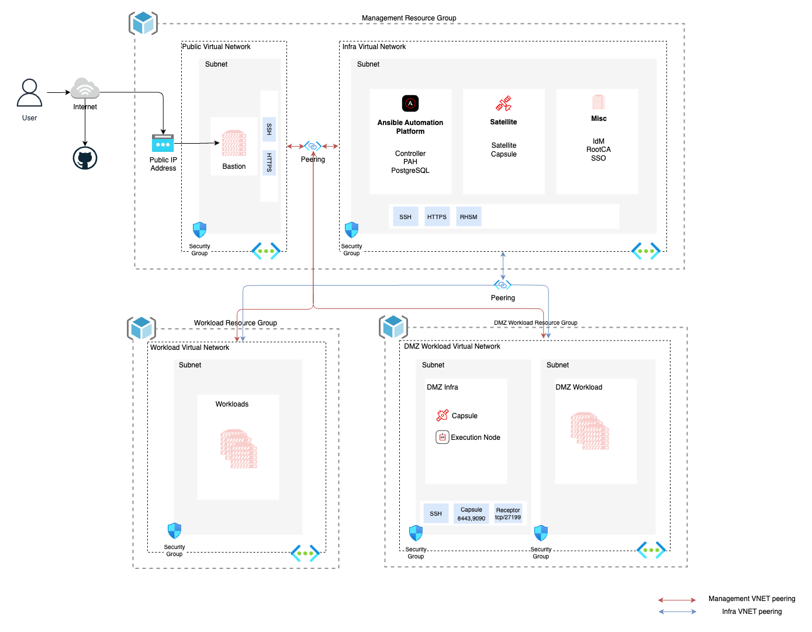

# Network overview

Since the aim is public clouds for this project we must try to make the implementations as cloud agnostic as possible so the approach can be inherited easily.

Since our current cloud provider is Azure this approach is following Azure naming standards.

{ align=center }

* Separate Virtual Networks for public, infra & workloads
* Virtual Network Peering will take place from public to all other networks for management.
* A peering between Infra to Workload VNETs to consume Infra services.
* Every Network Security Group must have explicit rules for allowing traffic from source to destination.
* Resource Groups will provide broader control on assets belongs to each of them.

!!! info

    Optionally, Peering can be eliminated to workload VNETs from Public VNET for additional security.
