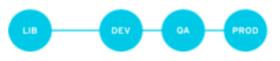

# Red Hat Satellite

This document outlines the high-level design for the installation of Red
Hat Satellite. Red Hat Satellite is directly responsible to provide
provisioning, software and patch management for the virtual machines
present on the cloud provider.

This document provides a comprehensive overview for deploying the Red
Hat Satellite solution, tailored to the specified requirements. For
further details and step-by-step implementation guidance, refer to the
official Red Hat Satellite [overview, concepts and deployment
guideline](https://access.redhat.com/documentation/en-us/red_hat_satellite/6.15/html/overview_concepts_and_deployment_considerations/index)
documentation and installation guides.

Deployment type will be connected which means that Red Hat Satellite
connects directly to the Red Hat Content Delivery Network (CDN) through
the internet. Proxy configuration will not be used for internet access.

## High Level Design

### System Configuration

1.  x86\_64 architecture

2.  The latest version of Red Hat Enterprise Linux 8

3.  4-core 2.0 GHz CPU at a minimum

4.  32GB of RAM

5.  fully qualified hostname

6.  Azure virtual instance `E4as`

7.  high-bandwidth, low-latency storage, with standard or premium SSD
    type disk with 500 GB space

#### File System Configuration

<table>
<colgroup>
<col style="width: 50%" />
<col style="width: 50%" />
</colgroup>
<thead>
<tr class="header">
<th style="text-align: left;">/var/lib/pgsql</th>
<th style="text-align: left;">20 GB</th>
</tr>
</thead>
<tbody>
<tr class="odd">
<td style="text-align: left;">
/var/lib/pulp
</td>
<td style="text-align: left;">
400 GB
</td>
</tr>
</tbody>
</table>

### Certificates

Red Hat Satellite Server will use an SSL certificate signed by an
external certificate authority (CA) which is Red Hat Identity Management
acting as a subordinate Certificate Authority. Refer to the certificate
requirements from the official
[documentation](https://access.redhat.com/documentation/en-us/red_hat_satellite/6.15/html/installing_satellite_server_in_a_connected_network_environment/performing-additional-configuration-on-server_satellite#Configuring_Server_with_a_Custom_SSL_Certificate_satellite).

### Operating Systems

Operating systems will be configured as below;

<table>
<colgroup>
<col style="width: 50%" />
<col style="width: 50%" />
</colgroup>
<thead>
<tr class="header">
<th style="text-align: left;">Name</th>
<th style="text-align: left;">Description</th>
</tr>
</thead>
<tbody>
<tr class="odd">
<td style="text-align: left;">
RedHat 8.9
</td>
<td style="text-align: left;">
Red Hat Enterprise Linux 8.9
</td>
</tr>
<tr class="even">
<td style="text-align: left;">
RHEL 8.10
</td>
<td style="text-align: left;">
Red Hat Enterprise Linux 8.10
</td>
</tr>
<tr class="odd">
<td style="text-align: left;">
RedHat 9.3
</td>
<td style="text-align: left;">
Red Hat Enterprise Linux 9.3
</td>
</tr>
<tr class="even">
<td style="text-align: left;">
RedHat 9.4
</td>
<td style="text-align: left;">
Red Hat Enterprise Linux 9.4
</td>
</tr>

</tbody>
</table>

### Architectural Diagram

## Network Requirements

Network ports requirements for Intranet hosts

Network port requirements for DMZ hosts

Firewall configurations could be found on the [official
documentation](https://access.redhat.com/documentation/en-us/red_hat_satellite/6.15/html-single/installing_satellite_server_in_a_connected_network_environment/index#Port_and_firewall_requirements_satellite)
for the connected Red Hat Satellite.

## Provisioning

In Satellite, you can integrate with RHEL web console to perform actions
and monitor your hosts. Satellite can interact with Microsoft Azure
Resource Manager, including creating new virtual machines and
controlling their power management states. Only image-based provisioning
is supported for creating Azure hosts.

DNS, DHCP and TFTP services will not be managed by Satellite, and Red
Hat Identity Management (RHDIdM) integration will be configured for user
and host management. Cloud Providers option will be used as a
provisioning method in Red Hat Satellite.

## Organizations

Red Hat Satellite will have only one organization.

<table>
<colgroup>
<col style="width: 50%" />
<col style="width: 50%" />
</colgroup>
<thead>
<tr class="header">
<th style="text-align: left;">Name</th>
<th style="text-align: left;">Description</th>
</tr>
</thead>
<tbody>
<tr class="odd">
<td style="text-align: left;">
Showroom
</td>
<td style="text-align: left;">
Showroom Organization
</td>
</tr>
</tbody>
</table>

## Locations

Mainly there are two locations,

<table>
<colgroup>
<col style="width: 50%" />
<col style="width: 50%" />
</colgroup>
<thead>
<tr class="header">
<th style="text-align: left;">Name</th>
<th style="text-align: left;">Description</th>
</tr>
</thead>
<tbody>
<tr class="odd">
<td style="text-align: left;">
Intranet
</td>
<td style="text-align: left;">
for internal business workloads and
infrastructure management services
</td>
</tr>
<tr class="even">
<td style="text-align: left;">
DMZ
</td>
<td style="text-align: left;">
for the business workloads which have
public access enabled
</td>
</tr>
</tbody>
</table>

## Capsule

Additional Red Hat Satellite Capsule deployed in DMZ location, which
will act as a content proxy. A connection between Red Hat Satellite and
Red Hat Satellite Capsule will have secure, encrypted connection between
virtual networks.

## Content Lifecycle

Satellite provides features for precise management of the content
lifecycle. A lifecycle environment represents a stage in the content
lifecycle, a Content View is a filtered set of content, and can be
considered as a defined subset of content.

**A single lifecycle environment path** – both operating system and
applications content is promoted through the same path. The path can
consist of several stages (for example Development, QA, Production),
which enables thorough testing but requires additional effort. The
following lifecycle structure will be used:

<table>
<colgroup>
<col style="width: 50%" />
<col style="width: 50%" />
</colgroup>
<thead>
<tr class="header">
<th style="text-align: left;">Name</th>
<th style="text-align: left;">Description</th>
</tr>
</thead>
<tbody>
<tr class="odd">
<td style="text-align: left;">
Library
</td>
<td style="text-align: left;">
Default content
</td>
</tr>
<tr class="even">
<td style="text-align: left;">
Dev
</td>
<td style="text-align: left;">
Development content
</td>
</tr>
<tr class="odd">
<td style="text-align: left;">
QA
</td>
<td style="text-align: left;">
QA UAT content
</td>
</tr>
<tr class="even">
<td style="text-align: left;">
Prod
</td>
<td style="text-align: left;">
Production content
</td>
</tr>
</tbody>
</table>

## Host Groups

Red Hat Satellite provides several logical units for grouping hosts.
Hosts that are members of those groups inherit the group configuration.
Host groups can be nested to inherit parameters from each other allows
for designing host group hierarchies that fit particular workflows. We
consider to use `Lifecycle environment based structure`. This hierarchy
is based on a lifecycle environment.

`Dev` environment is aimed in the project to be deployed first of all.
Host groups can be extended based on the daily requirements.

<table>
<colgroup>
<col style="width: 33%" />
<col style="width: 33%" />
<col style="width: 33%" />
</colgroup>
<thead>
<tr class="header">
<th style="text-align: left;">Name</th>
<th style="text-align: left;">Parent</th>
<th style="text-align: left;">Description</th>
</tr>
</thead>
<tbody>
<tr class="odd">
<td style="text-align: left;">
hg_mgmt_dev
</td>
<td style="text-align: left;">
-
</td>
<td style="text-align: left;">
Management Servers Host Group for Development
</td>
</tr>
<tr class="even">
<td style="text-align: left;">
hg_work_dev
</td>
<td style="text-align: left;">
-
</td>
<td style="text-align: left;">
Workload Servers Host Group for Development
</td>
</tr>
<tr class="odd">
<td style="text-align: left;">
hg_work_qa
</td>
<td style="text-align: left;">
-
</td>
<td style="text-align: left;">
Workload Servers Host Group for QA
</td>
</tr>
<tr class="even">
<td style="text-align: left;">
hg_work_prod
</td>
<td style="text-align: left;">
-
</td>
<td style="text-align: left;">
Workload Servers Host Group for Production
</td>
</tr>
<tr class="odd">
<td style="text-align: left;">
hg_intranet
</td>
<td style="text-align: left;">
hg_mgmt_dev
</td>
<td style="text-align: left;">
Intranet Management Servers Host Group for Development
</td>
</tr>
<tr class="even">
<td style="text-align: left;">
hg_intranet
</td>
<td style="text-align: left;">
hg_work_dev
</td>
<td style="text-align: left;">
Intranet Workload Servers Host Group for Development
</td>
</tr>
<tr class="odd">
<td style="text-align: left;">
hg_intranet
</td>
<td style="text-align: left;">
hg_work_qa
</td>
<td style="text-align: left;">
Intranet Workload Servers Host Group for QAT
</td>
</tr>
<tr class="even">
<td style="text-align: left;">
hg_intranet
</td>
<td style="text-align: left;">
hg_work_prod
</td>
<td style="text-align: left;">
Intranet Workload Servers Host Group for Production
</td>
</tr>
<tr class="odd">
<td style="text-align: left;">
hg_rhel8.9
</td>
<td style="text-align: left;">
hg_mgmt_dev/hg_intranet
</td>
<td style="text-align: left;">
Host Group for RHEL8.9 systems
</td>
</tr>
<tr class="even">
<td style="text-align: left;">
hg_rhel8.10
</td>
<td style="text-align: left;">
hg_mgmt_dev/hg_intranet
</td>
<td style="text-align: left;">
Host Group for RHEL8.10 systems
</td>
</tr>
<tr class="odd">
<td style="text-align: left;">
hg_capsule
</td>
<td style="text-align: left;">
hg_mgmt_dev/hg_intranet/hg_rhel8.10
</td>
<td style="text-align: left;">
Host Group for Red Hat Satellite Capsule
</td>
</tr>
<tr class="even">
<td style="text-align: left;">
hg_epel
</td>
<td style="text-align: left;">
hg_mgmt_dev/hg_intranet/hg_rhel8.10
</td>
<td style="text-align: left;">
Host Group EPEL enabled systems
</td>
</tr>
<tr class="odd">
<td style="text-align: left;">
hg_rhel9.3
</td>
<td style="text-align: left;">
hg_mgmt_dev/hg_intranet
</td>
<td style="text-align: left;">
Host Group for RHEL 9.3 systems
</td>
</tr>
<tr class="even">
<td style="text-align: left;">
hg_rhel9.4
</td>
<td style="text-align: left;">
hg_mgmt_dev/hg_intranet
</td>
<td style="text-align: left;">
Host Group for RHEL 9.4 systems
</td>
</tr>
<tr class="odd">
<td style="text-align: left;">
hg_aap
</td>
<td style="text-align: left;">
hg_mgmt_dev/hg_intranet/hg_rhel9.4
</td>
<td style="text-align: left;">
Host Group for Red Hat Ansible Automation Platform
</td>
</tr>
<tr class="even">
<td style="text-align: left;">
hg_rhel8.9
</td>
<td style="text-align: left;">
hg_work_dev/hg_intranet
</td>
<td style="text-align: left;">
Host Group for RHEL8.9 systems
</td>
</tr>
<tr class="odd">
<td style="text-align: left;">
hg_rhel8.10
</td>
<td style="text-align: left;">
hg_work_dev/hg_intranet
</td>
<td style="text-align: left;">
Host Group for RHEL8.10 systems
</td>
</tr>
<tr class="even">
<td style="text-align: left;">
hg_rhel9.3
</td>
<td style="text-align: left;">
hg_work_dev/hg_intranet
</td>
<td style="text-align: left;">
Host Group for RHEL 9.3 systems
</td>
</tr>
<tr class="odd">
<td style="text-align: left;">
hg_rhel9.4
</td>
<td style="text-align: left;">
hg_work_dev/hg_intranet
</td>
<td style="text-align: left;">
Host Group for RHEL 9.4 systems
</td>
</tr>
<tr class="even">
<td style="text-align: left;">
hg_rhel8.9
</td>
<td style="text-align: left;">
hg_work_qa/hg_intranet
</td>
<td style="text-align: left;">
Host Group for RHEL8.9 systems
</td>
</tr>
<tr class="odd">
<td style="text-align: left;">
hg_rhel8.10
</td>
<td style="text-align: left;">
hg_work_qa/hg_intranet
</td>
<td style="text-align: left;">
Host Group for RHEL8.10 systems
</td>
</tr>
<tr class="even">
<td style="text-align: left;">
hg_rhel9.3
</td>
<td style="text-align: left;">
hg_work_qa/hg_intranet
</td>
<td style="text-align: left;">
Host Group for RHEL 9.3 systems
</td>
</tr>
<tr class="odd">
<td style="text-align: left;">
hg_rhel9.4
</td>
<td style="text-align: left;">
hg_work_qa/hg_intranet
</td>
<td style="text-align: left;">
Host Group for RHEL 9.4 systems
</td>
</tr>
<tr class="even">
<td style="text-align: left;">
hg_rhel8.9
</td>
<td style="text-align: left;">
hg_work_qa/hg_intranet
</td>
<td style="text-align: left;">
Host Group for RHEL8.9 systems
</td>
</tr>
<tr class="odd">
<td style="text-align: left;">
hg_rhel8.10
</td>
<td style="text-align: left;">
hg_work_prod/hg_intranet
</td>
<td style="text-align: left;">
Host Group for RHEL8.10 systems
</td>
</tr>
<tr class="even">
<td style="text-align: left;">
hg_rhel9.3
</td>
<td style="text-align: left;">
hg_work_prod/hg_intranet
</td>
<td style="text-align: left;">
Host Group for RHEL 9.3 systems
</td>
</tr>
<tr class="odd">
<td style="text-align: left;">
hg_rhel9.4
</td>
<td style="text-align: left;">
hg_work_prod/hg_intranet
</td>
<td style="text-align: left;">
Host Group for RHEL 9.4 systems
</td>
</tr>
</tbody>
</table>

## Security Management

Satellite supports security management in various ways, including update
and errata management, OpenSCAP integration for system verification,
update and security compliance reporting, and fine grained role based
authentication.

### SElinux

SELinux enabled as a system default on Red Hat Satellite Server.

### FIPS Mode

FIPS mode must be enabled on the system before Red Hat Satellite
installation. Satellite also supports provisioning hosts that comply
with FIPS. Please refer to the
[documentation](https://access.redhat.com/documentation/en-us/red_hat_satellite/6.15/html-single/provisioning_hosts/index#Provisioning_FIPS_Compliant_Hosts_provisioning).

## Entitlement-based Subscription Management

Simple Content Access (SCA) will be used as a subscription management
mode. There is no requirement of attaching the Red Hat Satellite
Infrastructure Subscription to the Satellite Server using
subscription-manager.

## Realms

Red Hat Satellite has a realm feature that will automatically manage the
life cycle of any system registered to a realm or domain provider which
will be enabled.

### Auto Membership

Identity Management (IDM) supports the ability to set up automatic
membership rules based on a system’s attributes. Red Hat Satellite’s
realm feature provides administrators with the ability to map the Red
Hat Satellite host groups to the IDM parameter "userclass" which allow
administrators to configure automembership. This feature will be enabled
which allows when a system is added to the Satellite Server’s
hostgroup\_name host group, it will now automatically be added to the
Identity Management server’s "hostgroup\_name" host group as well. IDM
host groups allow for Host-Based Access Controls (HBAC), sudo policies
and other IDM functions.

## Domains

<table>
<colgroup>
<col style="width: 50%" />
<col style="width: 50%" />
</colgroup>
<thead>
<tr class="header">
<th style="text-align: left;">Intranet</th>
<th style="text-align: left;">internal.showroom.run</th>
</tr>
</thead>
<tbody>
<tr class="odd">
<td style="text-align: left;">
DMZ
</td>
<td style="text-align: left;">
showroom.run
</td>
</tr>
</tbody>
</table>

## Subnets

All existing subnets to use in the inventory will be configured on Red
Hat Satellite.

<table>
<colgroup>
<col style="width: 50%" />
<col style="width: 50%" />
</colgroup>
<thead>
<tr class="header">
<th style="text-align: left;">Subnet Name</th>
<th style="text-align: left;">Subnet</th>
</tr>
</thead>
<tbody>
<tr class="odd">
<td style="text-align: left;">
Public
</td>
<td style="text-align: left;">
10.1.0.0/29
</td>
</tr>
<tr class="even">
<td style="text-align: left;">
Intra Management
</td>
<td style="text-align: left;">
10.1.1.0/24
</td>
</tr>
<tr class="odd">
<td style="text-align: left;">
Intra Workload
</td>
<td style="text-align: left;">
10.1.2.0/24
</td>
</tr>
<tr class="even">
<td style="text-align: left;">
DMZ Management
</td>
<td style="text-align: left;">
10.1.3.0/29
</td>
</tr>
<tr class="odd">
<td style="text-align: left;">
DMZ Workload
</td>
<td style="text-align: left;">
10.1.3.128/25
</td>
</tr>
</tbody>
</table>

## Users, Roles and Role Based Access Controls

Red Hat Satellite support to use Red Hat Identity Management as external
Authentication source. Red Hat IdM will be configured as an
Authentication provider. Users and groups from Red Hat Identity
Management will be configured as follows;

<table>
<colgroup>
<col style="width: 50%" />
<col style="width: 50%" />
</colgroup>
<thead>
<tr class="header">
<th style="text-align: left;">User Group</th>
<th style="text-align: left;">Role</th>
</tr>
</thead>
<tbody>
<tr class="odd">
<td style="text-align: left;">
satellite-admins
</td>
<td style="text-align: left;">
Administrator
</td>
</tr>
<tr class="even">
<td style="text-align: left;">
satellite-users
</td>
<td style="text-align: left;">
Viewer
</td>
</tr>
</tbody>
</table>

It is expected to use GitOps Framework to configure Red Hat Satellite,
and therefore there is no need to define any access to Red Hat Satellite
WebUI.

## Insights

Red Hat Insights will be installed on Red Hat Satellite and registered
with Red Hat Insights to maintain the Satellite Server, and improve
ability to monitor and diagnose problems.

## Backup

It is planned to use built-in backup functionality to use in Red Hat
Satellite Server to facilitate recovery in the event of disaster.
`Online` backup mode will be used in the project by scheduling a job
template on Ansible Automation Controller.

## Tuning

No tuning option will be applied after deployment as the deployment will
not include more than 5000 hosts and `default` tuning profile will be
applied.
