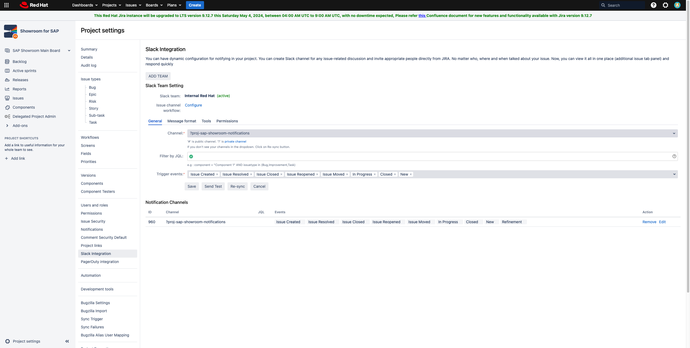

## Slack Integration
In this project, Slack is used as the centralized notification service.
We established an efficient communication channel where team members are
not allowed to send any messages, but only the integrated applications
can send notifications. This setup integrates seamlessly with our
development workflow, allowing us to stay informed about important
events in real-time.

!!! info

    We use following channel for notifications on Slack. [cop-rhis-notifications](https://redhat.enterprise.slack.com/archives/C06VCEWRQE4)

## GitHub Integration

We utilize GitHub and Slack integration to monitor new pull requests and
automated pipeline runs, ensuring that every team member is promptly
notified of any code contributions and/or workflow results.More
comprehensive customizations can be found in [this
repo](https://github.com/integrations/slack). To be able to use this
integration, GitHub app should be installed on Slack from
[here](https://redhat-external.slack.com/apps/A01BP7R4KNY-github?tab=more_info).

    # invite GitHub application and authenticate
    /invite @github

    # receive notifications only on pull request creation and workflow run
    /github subscribe redhat-cop/rhis-code pulls workflows:{event:"pull_request" branch:"main"}
    /github unsubscribe redhat-cop/rhis-code issues commits releases deployments

    /github subscribe redhat-cop/rhis-inventory pulls workflows:{event:"pull_request" branch:"main"}
    /github unsubscribe redhat-cop/rhis-inventory issues commits releases deployments

## Jira Integration

In-house developed Slack integration called [Red Hat Jira
Connector](https://source.redhat.com/personal_blogs/get_a_dm_in_slack_when_youre_mentioned_on_a_jira_issue)
allows Jira to send notifications on certain actions. You can customize
these notifications by navigating to Project Settings and then Slack
Integartion tab. We have limited these actions with only the followings:
Issue Created, Issue Resolved, Issue Closed, Issue Reopened, Issue
Moved, In Progress, Closed New Refinement.

